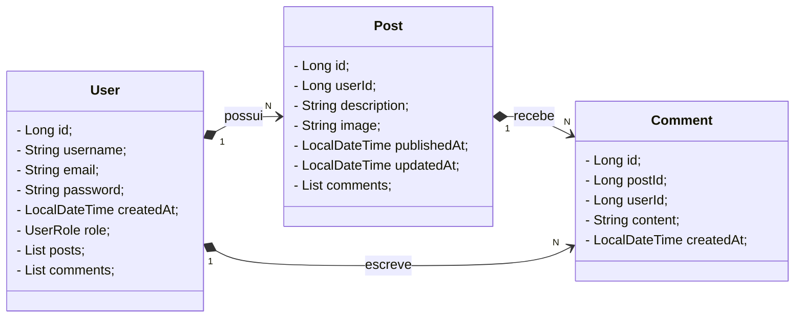

<p align="center">
    
</p>


# Decola.feed


Esse projeto é uma API RestFull contruída com **Java, Spring Boot, PostgresSQL como banco de dados, Railway para hospedagem e Swagger para documentar e consumir a API.**

A API foi criada como parte do desafio do programa Decola Tech 2025 da Avanade e simula a dinâmica de uma rede social corporativa, permitindo a interação entre três entidades principais: **Usuário, Postagem e Comentário**.

## ↗️Diagrama de classes



## 📍API Endpoints
A API fornece os seguintes endpoints:

#### Usuário
```markdown
GET /users/{id} - Retorna o usuário pelo ID especificado

PUT /users/{id} - Atualiza o usuário pelo ID especificado

DELETE /users/{id} - Deleta o usuário pelo ID especificado

GET /users - Retorna a lista de usuários

POST /users - Registra um novo usuário
```

#### Postagem

```markdown
GET /posts/{id} - Retorna o post pelo ID especificado

PUT /posts/{id} - Atualiza o post pelo ID especificado

DELETE /post/{id} - Deleta o post pelo ID especificado

GET /posts - Retorna a lista de posts

POST /posts - Registra um novo post
```

#### Comentário

```markdown
GET /comments/{id} - Retorna o comentário pelo ID especificado

PUT /comments/{id} - Atualiza o comentário pelo ID especificado

DELETE /comments/{id} - Deleta o comentário pelo ID especificado

GET /comments - Retorna a lista de comentários

POST /comments - Registra um novo comentário
```

## 👉Exemplos de Get e Post da entidade User 
<h3>GET /users</h3>

**RESPONSE**
```json
{
  "id": 1,
  "username": "Danilo Fernandes",
  "email": "exemplo@gmail.com",
  "createdAt": "2025-03-19T19:28:29.456Z"
}
```
<h3>POST /users</h3>

**RESPONSE**
```json
{
  "username": "danilo",
  "email": "exemplo@gmail.com",
  "password": "string"
}
```

<h2 id="colab">🤝 Colaborador</h2>
<table>
  <tr>
    <td align="center">
      <a href="#">
        <br>
        <sub>
          <b>Danilo Fernandes</b>
        </sub>
      </a>
    </td>
  </tr>
</table>
